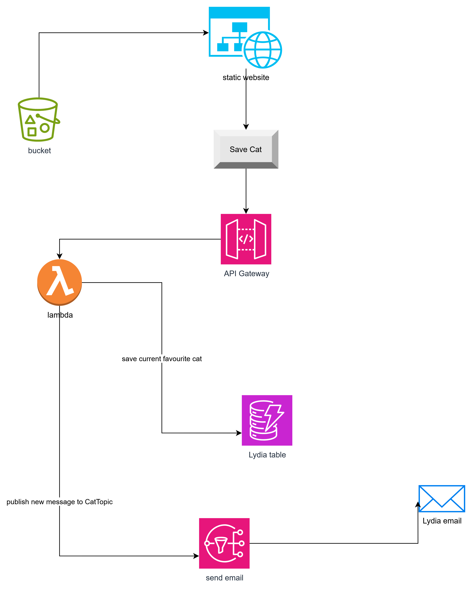

## Lydia's Favourite Cat

Lydia wants to have a static website that shows a random cat picture from the internet and allows it to be saved as a favorite.
The cat images are provided by _caatas.com_ and accessed via GET request.
Every time the user clicks the "Save cat" button, this cat is saved in the system, and Lydia(project owner) gets a message that they have a new favorite cat.

### AWS services

- S3 bucket with static website
- dynamoDB table
- SNS topic and subscription
- lambda function
- custom BaseFunction
- API Gateway

### Other implementations

- Snapshot test
- CI/CD pipeline with GIT Actions

### Architectural Diagram

### Cost Estimation

Ca. 78,036 USD/month